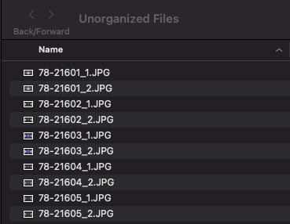
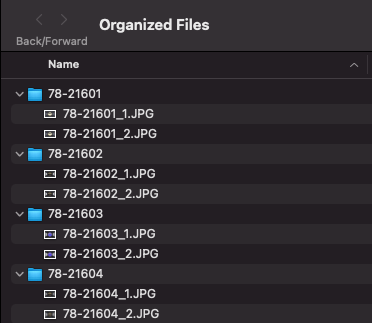

# FTP Scripts: Scripts to Assist with FromThePage Workflows

### Below there are step by step instructions to how to use these scripts assuming the user has little-to-no Python experience
#### Be aware that the "csv_to_yml.py" script uses the folder structure that is created from the first script.

#### Created by [Rolando Rodriguez](https://github.com/RolRodr) for UNC Libraries 

## Table of Contents

1. [Sorting record files into respective folders for uploading to FTP](#sorting-record-files)

2. [Converting CSV file of record metadata to YAML files for uploading to FTP](#converting-metadata-csv-to-yaml-files)

## Sorting Record Files

### 1. FromThePage Importing Guidelines

In brief, the "rules" for uploading files to FromThePage are:
* Works may be uploaded as ZIP files or PDFs with images. 
* ZIP Files may contain images only in the following formats: PDF, PNG, GIF, and JPG
* Folders PDFS within the ZIP file are treated as their own documents
* Files within a folder are treated as files pertaining to one particular work

[Click here for the complete guideline from the FromThePage website.](https://content.fromthepage.com/project-owner-documentation/image-upload-file-guidelines/)

### 2. What this script Does

This script is meant to organize the contents of a folder such as this: 

The organized version, ready for uploading into a FromThePage collection, looks like this: 

### 3. Setting up your local environment

#### COMING SOON

### 4. Downloading and Running the Script

#### COMING SOON

## Converting Metadata CSV to YAML files

### COMING SOON 
