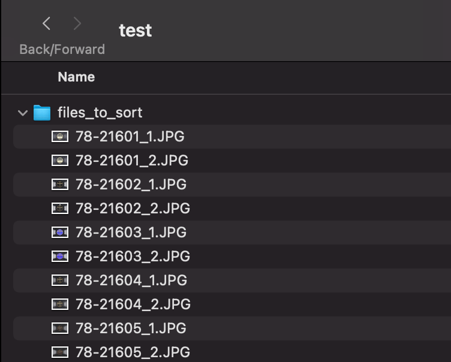
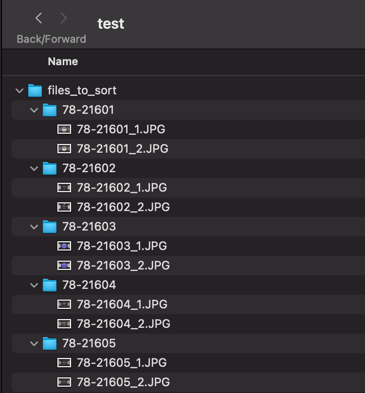
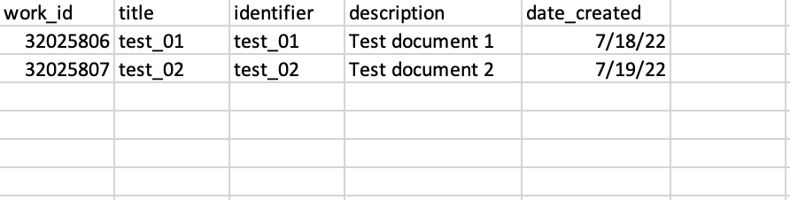
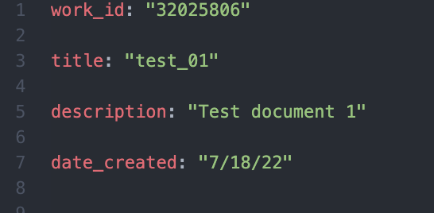

# FTP Scripts: Scripts to Assist with FromThePage Workflows

### Below there are step by step instructions to how to use these scripts assuming the user has little-to-no Python experience
#### Be aware that the "csv_to_yml.py" script uses the folder structure that is created from the first script.

#### Created by [Rolando Rodriguez](https://github.com/RolRodr) for UNC Libraries

# Table of Contents

1. [Sorting record files into respective folders for uploading to FTP](#sorting-record-files)

2. [Converting CSV file of record metadata to YAML files for uploading to FTP](#converting-metadata-csv-to-yaml-files)

# Sorting Record Files

## 1. FromThePage Importing Guidelines

In brief, the "rules" for uploading files to FromThePage are:
* Works may be uploaded as ZIP files or PDFs with images.
* ZIP Files may contain images only in the following formats: PDF, PNG, GIF, and JPG
* Folders PDFS within the ZIP file are treated as their own documents
* Files within a folder are treated as files pertaining to one particular work

[Click here for the complete guideline from the FromThePage website.](https://content.fromthepage.com/project-owner-documentation/image-upload-file-guidelines/)

## 2. What this script Does

This script is meant to organize the contents of a folder like that of the following image. We can see that each record has multiple files. For example: '78-21601_1.JPG' and '78-21601_2.JPG' both pertain the item titled '78-21601.'

The organized version, ready for uploading into a FromThePage collection, has all the files pertaining to a single item are organized into a folder with the item number.

## 3. Setting Up Your Local Environment

Before you can successfully run the script, you will need to have all the files needed to be organized within a single folder in an easy-to-locate location, as you will need navigate to the folder's location through the command line/terminal.

## 4. Downloading the Script

1. Navigate to the [script's page within the Github repository](./sort_record_files.py).

2. Click on the 'Raw' option to view the raw file in your browser.

3. Right (Windows) or double click (Mac) on the new page, click 'Save As...'

When the 'Save as...' window pops up, you will want to change the extension of the file from the default '.txt' to '.py'; this will change the file from a text to a Python file. The Python file should be saved in the parent directory of the folder to be sorted.

## 5. Running the Script

### Opening the Terminal
1. Open the command prompt (Windows) or terminal (Mac/Linux) within the parent directory of the folder containing the files.

2. Type in `python sort_record_files.py` into the command prompt/terminal then press enter/return.

Your folder **before** running the script should look something like this:

Your folder **after** running the script should look something like this:

# Converting Metadata CSV to YAML files

## 1. CSV template
The CSV should have a column named 'identifier' which is what will be used to place the YAML file within the correct folder.
Here is an example:

Other columns will be used to create the YAML file named `metadata.yml` within each work folder, which will look something like this:

## 2. Setting Up Your Local Environment
Move the CSV you will want to convert to the parent directory of the folder containing the works to be uploaded. This script assumes you have the similar folder structures to the resulting folder from the 'sort_record_files.py' script. It also assumes that the folder the works are in is called **files_to_sort** and the CSV is called **metadata.csv**. If you want to change this, after you have downloaded the script, open it in a text/script editor and edit the following lines:
* Change the `metadata.csv` in `with open('./metadata.csv', newline='') as md:` to the name of your CSV file.

* Change `files_sort` folder name in `file_path = "./files_to_sort/"+record['identifier'] + '/' + 'metadata.yml'` to the name of the folder you are using.

## 3. Downloading the Script
Follow the same directions as the previous script except using [csv_to_yml.py](./csv_to_yml.py) instead.

## 4. Running the Script
Follow the same directions as the previous script except using `python csv_to_yml.py` in the command prompt/terminal.
